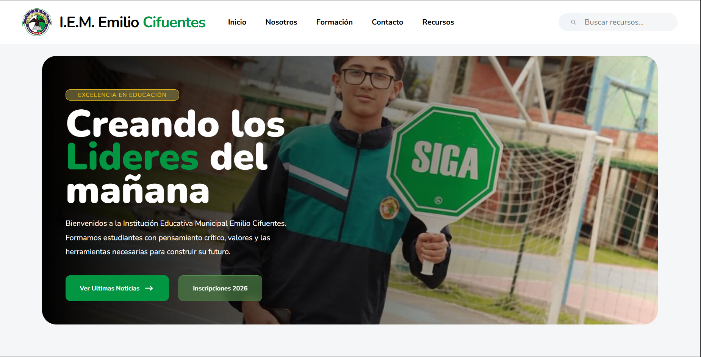
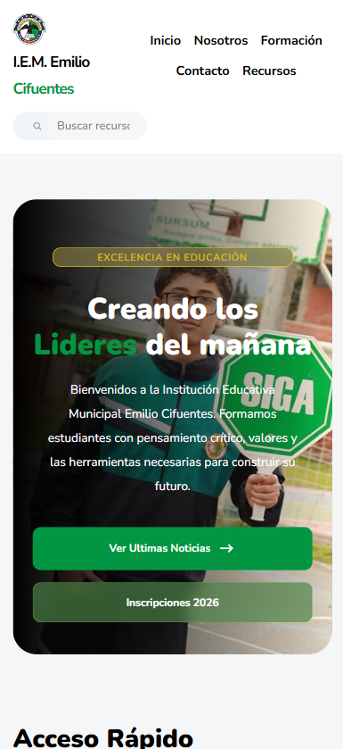

# 🎓 Rediseño Web – Institución Educativa Municipal Emilio Cifuentes

Proyecto de **rediseño moderno del sitio web institucional** de la  
**Institución Educativa Municipal Emilio Cifuentes**.

El objetivo del proyecto es mejorar la **experiencia de usuario**, modernizar el diseño visual y crear una versión **responsive y optimizada** del sitio institucional.

Actualmente el proyecto se encuentra en fase **MVP (Minimum Viable Product)**.

---

# 🌐 Vista previa del proyecto

Puedes ver la versión en línea del proyecto aquí:

**🔗 Demo:**  
https://g4lvan.github.io/demo_page_colegio.github.io/

---

# 📸 Preview del diseño

### Versión Desktop

### Versión Mobile

---
# 📲 Responsive

---

# 🎯 Objetivos del proyecto

- Modernizar el diseño visual del sitio web
- Mejorar la experiencia de usuario (UX)
- Crear un diseño **totalmente responsive**
- Organizar mejor la información institucional
- Mejorar el rendimiento y tiempos de carga

---

# 🔍 Problemas detectados en el sitio actual

Durante el análisis del sitio web actual se identificaron varios problemas:

- Diseño visual desactualizado
- Problemas de adaptación en dispositivos móviles
- Secciones incompletas
- Mala organización de la información
- Animaciones poco optimizadas
- Rendimiento lento

Este proyecto busca proponer una solución moderna a estos problemas.

---

# ✨ Características del rediseño

- Diseño moderno y limpio
- Navegación clara e intuitiva
- Layout responsive (mobile-first)
- Mejor jerarquía visual
- Optimización de estructura HTML
- Base preparada para futuras mejoras

---

# 🧰 Tecnologías utilizadas

- **HTML5**
- **CSS3**
- **Responsive Design**
- **Mobile-first layout**

Posibles tecnologías futuras:

- Astro
- React
- CMS para gestión de contenido
- Integración de calendario institucional

---

# 📱 Diseño Responsive

El sitio está optimizado para distintos tamaños de pantalla:

- 📱 Móviles
- 📱 Tablets
- 💻 Laptops
- 🖥 Escritorio

Se implementan técnicas modernas de **Flexbox, Grid y Mobile-first design**.

---

# 🚀 Roadmap del proyecto

## MVP

- Rediseño visual del sitio
- Layout responsive
- Organización de secciones

## v1.0

- Optimización de rendimiento
- Mejoras visuales
- Animaciones suaves

## v2.0

- Sistema de noticias dinámico
- Calendario institucional
- Sistema de documentos

## v3.0

- Panel de administración (CMS)
- Gestión de contenido institucional
- Posible sistema de usuarios

---

# 🧠 Aprendizajes del proyecto

Este proyecto permite practicar:

- Diseño web moderno
- Arquitectura de páginas institucionales
- Responsive design
- Mejores prácticas de HTML y CSS

---

## 👨‍💻 Autor

Proyecto desarrollado como iniciativa personal para mejorar la presencia digital de la institución.

**Juan Andres Gallego Vanegas**

---

# 📜 Licencia

Este proyecto se distribuye bajo licencia **MIT**.
