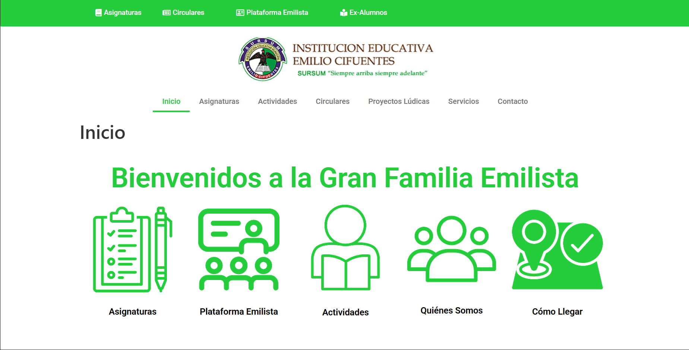
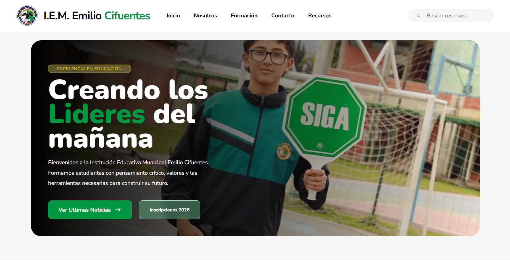
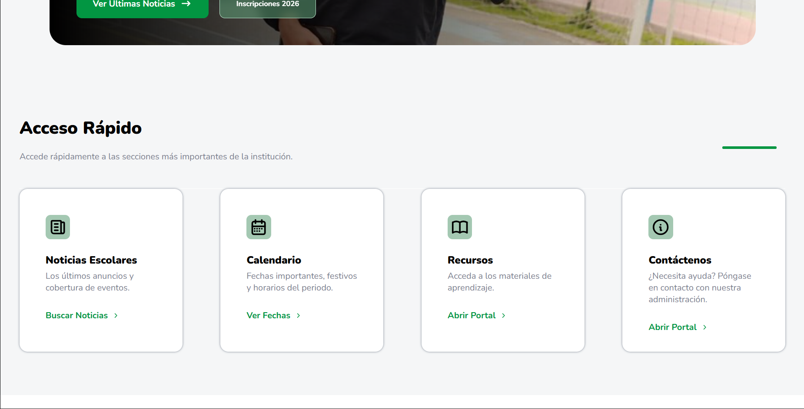
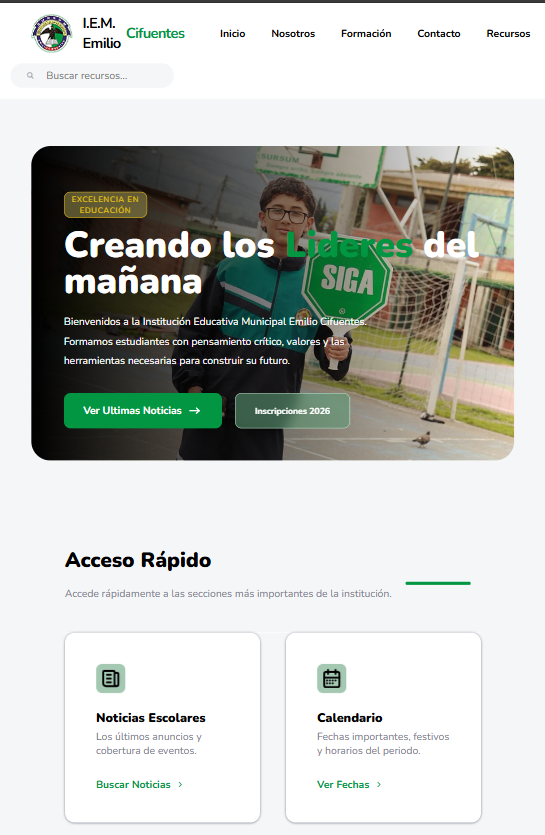

# 🎓 Rediseño Web – Institución Educativa Municipal Emilio Cifuentes

Proyecto enfocado en el **rediseño y mejora de la experiencia digital** del sitio web institucional de la  
**Institución Educativa Municipal Emilio Cifuentes**.

Este rediseño surge a partir de un análisis del sitio actual, donde se identificaron problemas de **usabilidad, rendimiento y adaptación a dispositivos móviles**.  
El objetivo es proponer una solución **moderna, responsive y centrada en el usuario**, aplicando buenas prácticas de desarrollo web.

Actualmente el proyecto se encuentra en fase **MVP (Minimum Viable Product)**.

---

# 🌐 Vista previa del proyecto

Puedes ver la versión en línea del proyecto aquí:

**🔗 Demo:**  
https://g4lvan.github.io/demo_page_colegio.github.io/

---

# 🆚 Comparación: Antes vs Después

### 🔴 Antes (sitio original)

El sitio actual presenta varios problemas de experiencia de usuario:

- Diseño basado en plantillas tradicionales
- Baja jerarquía visual (difícil de escanear)
- Exceso de texto sin estructura clara
- Navegación poco intuitiva
- Experiencia limitada en dispositivos móviles

---

### 🟢 Después (rediseño propuesto)

El rediseño propone una mejora integral enfocada en el usuario:

- Interfaz moderna y limpia
- Diseño responsive (mobile-first)
- Mejor organización del contenido
- Jerarquía visual clara
- Navegación más intuitiva y accesible

---

# 📸 Detalles del diseño

### Versión Desktop

### Versión Mobile

### Versión Tablet

---

# 📲 Responsive

---

# 🎯 Objetivos del proyecto

- Modernizar la interfaz del sitio web
- Mejorar la experiencia de usuario (UX)
- Implementar un diseño completamente responsive
- Reorganizar la estructura de la información
- Optimizar rendimiento y tiempos de carga

---

# 🔍 Problemas detectados en el sitio actual

Durante el análisis del sitio web original se identificaron:

- Diseño visual desactualizado
- Falta de adaptabilidad en dispositivos móviles
- Estructura de información poco clara
- Secciones incompletas
- Animaciones poco optimizadas
- Bajo rendimiento general

Este proyecto plantea una solución enfocada en resolver estos puntos de forma integral.

---

# 🧩 Enfoque del rediseño

El desarrollo del proyecto se basa en:

- Análisis del sitio existente
- Identificación de problemas de UX/UI
- Priorización de mejoras
- Implementación bajo enfoque **mobile-first**
- Uso de buenas prácticas en HTML y CSS

---

# ✨ Características del rediseño

- Diseño moderno y limpio
- Navegación clara e intuitiva
- Layout responsive (mobile-first)
- Mejor jerarquía visual
- Estructura HTML optimizada
- Base escalable para futuras mejoras

---

# 🧰 Tecnologías utilizadas

- **HTML5**
- **CSS3**
- **Responsive Design**
- **Mobile-first layout**

Posibles tecnologías futuras:

- Astro
- React
- CMS para gestión de contenido
- Integración de calendario institucional

---

# 📱 Diseño Responsive

El sitio está optimizado para distintos tamaños de pantalla:

- 📱 Móviles
- 📱 Tablets
- 💻 Laptops
- 🖥 Escritorio

Se implementan técnicas modernas como **Flexbox, Grid y Mobile-first design**.

---

# 🚀 Roadmap del proyecto

## MVP

- Rediseño visual del sitio
- Layout responsive
- Organización de secciones

## v1.0

- Optimización de rendimiento
- Mejoras visuales
- Animaciones más fluidas

## v2.0

- Sistema de noticias dinámico
- Calendario institucional
- Sistema de documentos

## v3.0

- Panel de administración (CMS)
- Gestión de contenido institucional
- Posible sistema de usuarios

---

# 🧠 Aprendizajes del proyecto

Este proyecto permitió reforzar:

- Diseño web moderno
- Arquitectura de sitios institucionales
- Responsive design
- Buenas prácticas en HTML y CSS
- Pensamiento orientado a UX

---

## 👨‍💻 Autor

Proyecto desarrollado como iniciativa personal para mejorar la presencia digital de la institución.

**Juan Andres Gallego Vanegas**

---

# 📜 Licencia

Este proyecto se distribuye bajo licencia **MIT**.
